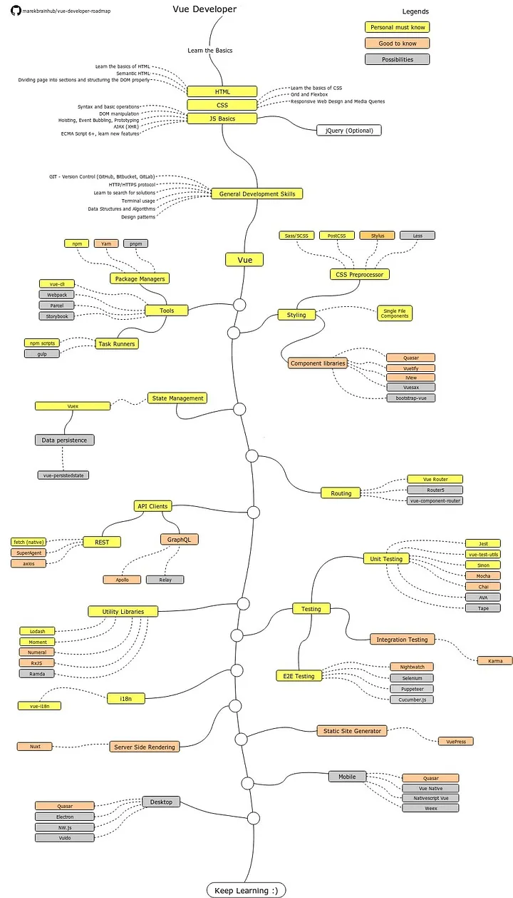

# Vue.js roadmap & exercises

  

- [x] Fundamentals
	- [x] Components
	- [X] Props
	- [X] Events
	- [X] Conditional Rendering
	- [X] Lists
	- [X] Forms handling
	- [X] Directives
	- [X] Routing
	- [X] State Management

 - [ ] Advanced
	- [ ] Composition API
	- [ ] Async Components
	- [ ] Teleport Component
	- [ ] Provide/Inject
	- [ ] Plugins
	- [ ] Watchers
	- [ ] Animation
	- [ ] Custom Directives
	- [ ] Custom Events
	- [ ] Vue Router

- [ ] Testing
	- [ ] Jest Testing
	- [ ] Cypress Testing
	- [ ] Vue Test Utils

- [ ] Styling
	- [ ] CSS
	- [ ] SCSS
	- [ ] Tailwind CSS
	- [ ] Bootstrap
	- [ ] Bulma

- [ ] SSR
	- [ ] Nuxt.js
	- [ ] Vue SSR

## Complex State Management (Pinia)

- [ ] Pinia ([Pinia Tutorial](https://blog.logrocket.com/complex-vue-3-state-management-pinia/))
  - [ ] Pinia with Composition API
  - [ ] Pinia with Vue 3

### Roadmap
